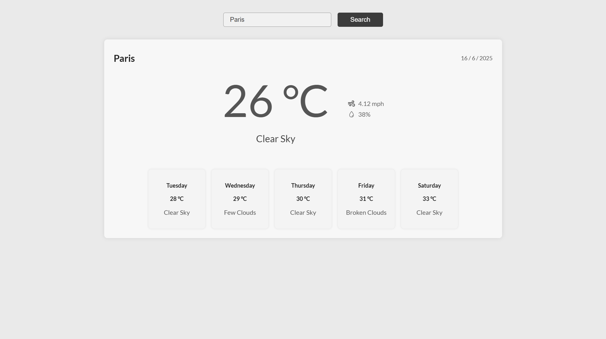

# ☁️ Weather App

A simple and elegant weather application built with React and Vite. This app allows users to search for the current weather and forecast of any city worldwide.

<<<<<<< HEAD
🔗 **Live Demo:** [https://weather-prod.netlify.app]
=======
🔗 **Live Demo:** [https://focusly-prod.netlify.app](https://weather-prod.netlify.app]
>>>>>>> ae7dfcb39ff0e18101786f3e70bc965d452726e4

## 📸 Preview



## Features

- Search weather by city name
- Display current temperature, weather condition, wind speed, and humidity
- View a multi-day weather forecast
- Responsive design for desktop and mobile
- Built with React Context API for state management
- Styled with styled-components for modular and reusable styles

## Installation

1. Clone the repository:
   ```bash
   git clone https://github.com/IulianFrunza98/weather-app
   ```
2. Navigate to the project directory:
   ```bash
   cd weather-app
   ```
3. Install dependencies:
   ```bash
   npm install
   ```
4. Start the development server:
   ```bash
   npm run dev
   ```

## Usage

- Enter the name of a city in the search bar.
- Click the "Search" button or press Enter.
- View the current weather and forecast for the searched city.

## Technologies Used

- React
- Vite
- styled-components
- React Icons

## Project Structure

```
weather-app/
├── public/                 # Static assets
├── src/
│   ├── components/         # React components (Search, WeatherDisplay, ForecastDisplay)
│   ├── contexts/           # React context for weather state management
│   ├── hooks/              # Custom hooks (if any)
│   ├── styles/             # CSS styles
│   ├── App.jsx             # Main app component
│   └── main.jsx            # Entry point
├── package.json            # Project metadata and dependencies
├── vite.config.js          # Vite configuration
└── README.md               # Project documentation
```

## License

This project is licensed under the MIT License.
