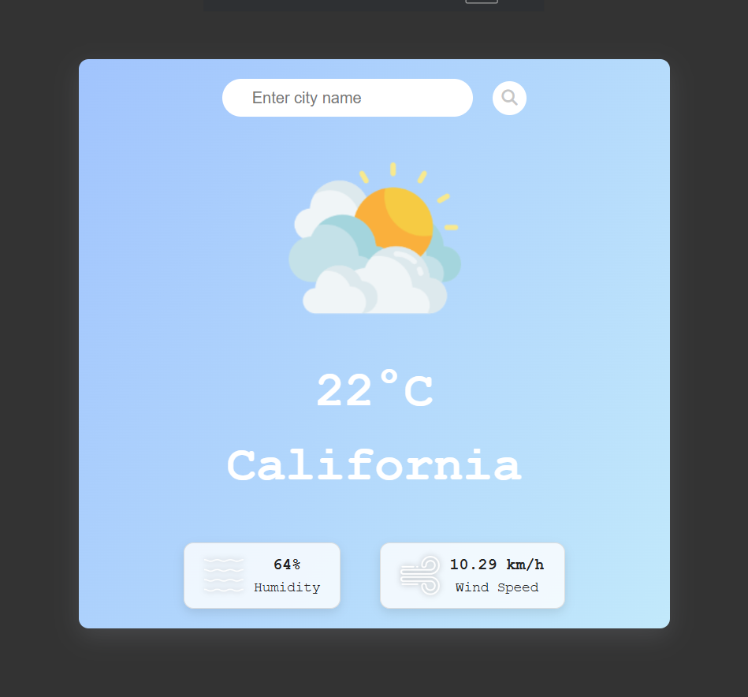

# 🌤️ Weather App

A simple and responsive weather application that allows users to search for the current weather conditions in any city using the [OpenWeatherMap API](https://openweathermap.org/api).

## 🚀 Features

- Search for current weather by city name
- Displays:
  - City name
  - Temperature
  - Humidity
  - Wind speed
  - Weather icon based on current conditions (e.g. clouds, clear, rain)
- Loading indicator while fetching data
- Responsive design

## 📸 Screenshot



## 🛠️ Technologies Used

- HTML5
- CSS3
- JavaScript (ES6 Modules)
- Font Awesome (for icons)
- OpenWeatherMap API

## 📦 Installation

1. **Clone the repository:**

```bash
git clone https://github.com/IulianFrunza98/weather-app.git
cd weather-app
```
